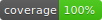

# Release

[](https://github.com/VGVentures/very_good_start/actions)
[](https://github.com/VGVentures/very_good_start/actions)
[](https://pub.dev/packages/very_good_analysis)

Generated with Very Good Start, by [Very Good Ventures](https://verygood.ventures).

## Getting Started 🚀

### Initial Setup ✅

If this is your first time running and compiling Release, please follow the [INITIAL_SETUP](./INITIAL_SETUP.md) checklist to configure the application correctly.

### Running the project 💻

This project contains the following flavors:

- development
- production


To run the desired flavor either use the launch configuration in VSCode/Android Studio or use the following commands:

```sh
# development
$ flutter run --flavor development --target lib/main/main_development.dart
# production
$ flutter run --flavor production --target lib/main/main_production.dart

```

_\*Release works on iOS, Android._

---

## Running Tests 🧪

To run all unit and widget tests use the following command:

```sh
$ flutter test --coverage --test-randomize-ordering-seed random
```

To view the generated coverage report you can use the internal script `tool/coverage.sh`. Make sure to install [lcov](https://github.com/linux-test-project/lcov) before.

```sh
# Generate coverage report for the app
$ ./tool/coverage.sh

# Generate coverage report for the package
$ ./tool/coverage.sh packages/app_config_repository
```

---

## Generating assets 🖼️

We're using [flutter_gen](https://pub.dev/packages/flutter_gen) to generate statically safe descriptions of image and font assets.

You need to install the `flutter_gen` tool via brew or pub, by following the [installation instruction](https://pub.dev/packages/flutter_gen/install). The configuration of the tool is stored in `pubspec.yaml`.

After that you can easily recreate the assets descriptions by calling:

```bash
$> fluttergen
```

Then to reference the asset you can call:

```dart
Assets.images.unicornVgvBlack.image(height: 120),
```

If you're adding new assets to ui library, make sure to run `fluttergen` inside the package directory as well.

## Generating New Packages 📦

We're using [very_good_cli](https://pub.dev/packages/very_good_cli) to generate internal packages.

You need to install the `very_good` tool via pub, by following the [installation instruction](https://pub.dev/packages/very_good_cli#installing).

After that you can easily generate new packages by running the following commands:

For a Dart package

```sh
$ very_good create packages/package_name -t dart_pkg --desc "Package description"
```

For a Flutter package

```sh
$ very_good create packages/package_name -t flutter_pkg --desc "Package description"
```

## Working with Translations 🌐

This project relies on [flutter_localizations](https://api.flutter.dev/flutter/flutter_localizations/flutter_localizations-library.html) and follows the [official internationalization guide for Flutter](https://flutter.dev/docs/development/accessibility-and-localization/internationalization).

### Adding Strings

1. To add a new localizable string, open the `app_en.arb` file at `lib/l10n/arb/app_en.arb`.

```arb
{
    "@@locale": "en",
    "counterAppBarTitle": "Counter",
    "@counterAppBarTitle": {
        "description": "Text shown in the AppBar of the Counter Page"
    }
}
```

2. Then add a new key/value and description

```arb
{
    "@@locale": "en",
    "counterAppBarTitle": "Counter",
    "@counterAppBarTitle": {
        "description": "Text shown in the AppBar of the Counter Page"
    },
    "helloWorld": "Hello World",
    "@helloWorld": {
        "description": "Hello World Text"
    }
}
```

3. Use the new string

```dart
import 'package:release_dance/l10n/l10n.dart';

@override
Widget build(BuildContext context) {
  final l10n = context.l10n;
  return Text(l10n.helloWorld);
}
```

### Adding Supported Locales

Update the `CFBundleLocalizations` array in the `Info.plist` at `ios/Runner/Info.plist` to include the new locale.

```xml
    ...

    <key>CFBundleLocalizations</key>
	<array>
		<string>en</string>
		<string>es</string>
	</array>

    ...
```

### Adding Translations

1. For each supported locale, add a new ARB file in `lib/l10n/arb`.

```
├── l10n
│   ├── arb
│   │   ├── app_en.arb
│   │   └── app_es.arb
```

2. Add the translated strings to each `.arb` file:

`app_en.arb`

```arb
{
    "@@locale": "en",
    "counterAppBarTitle": "Counter",
    "@counterAppBarTitle": {
        "description": "Text shown in the AppBar of the Counter Page"
    }
}
```

`app_es.arb`

```arb
{
    "@@locale": "es",
    "counterAppBarTitle": "Contador",
    "@counterAppBarTitle": {
        "description": "Texto mostrado en la AppBar de la página del contador"
    }
}
```

## Working with Mason 🧱

This project relies on [mason](https://github.com/felangel/mason) to create and consume reusable templates called bricks. For additional documentation see [BrickHub](https://docs.brickhub.dev).

1. Install mason from [pub](https://pub.dev):
```sh
dart pub global activate mason_cli
```

2. Check the current project bricks:
```sh
mason list
```

3. Add your own bricks:
```sh
mason add bloc
```

4. Generate code from a brick:
```sh
mason make bloc
```

> **Note**
> Mason support for Visual Studio Code can be found [here](https://marketplace.visualstudio.com/items?itemName=FelixAngelov.mason).